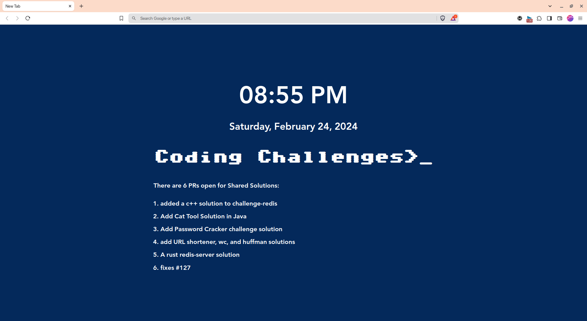

# Chrome Extension

This folder contains a Chrome extension developed as a solution to the challenge from [Coding Challenges](https://codingchallenges.fyi/challenges/challenge-chrome-extension/).

## Language Used

- HTML
- CSS
- JavaScript

## How to Install

1. Download the extension files from this repository.
2. Open the Chrome browser and navigate to `chrome://extensions`.
3. Enable Developer Mode by clicking the toggle switch.
4. Click `Load unpacked` and select the downloaded extension folder.

## Usage

After installing the extension, open a new tab in Chrome. You should see the Coding Challenges Chrome Extension page with dynamic content:
- Time and date
- current opened Pull Requests from the Coding Challenges repository

## Screenshots

